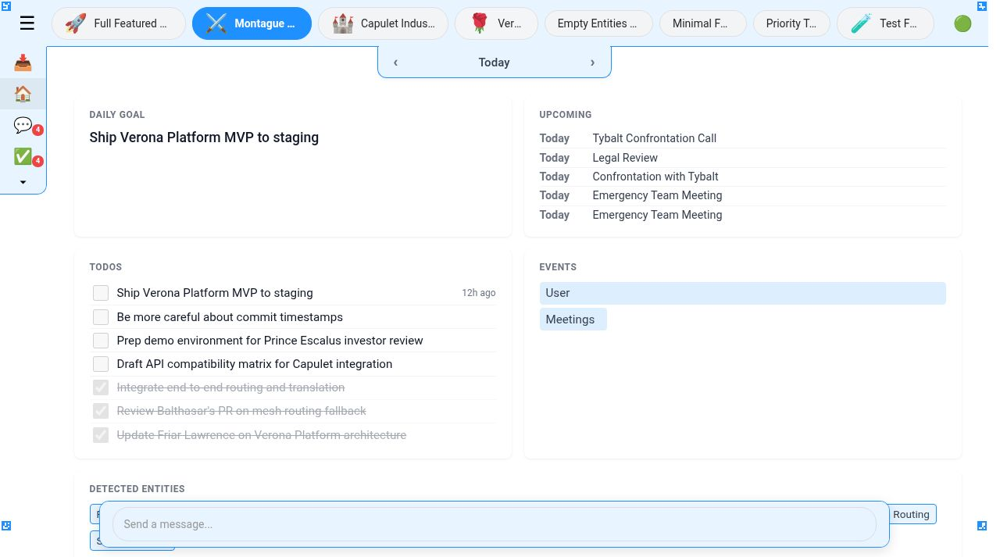
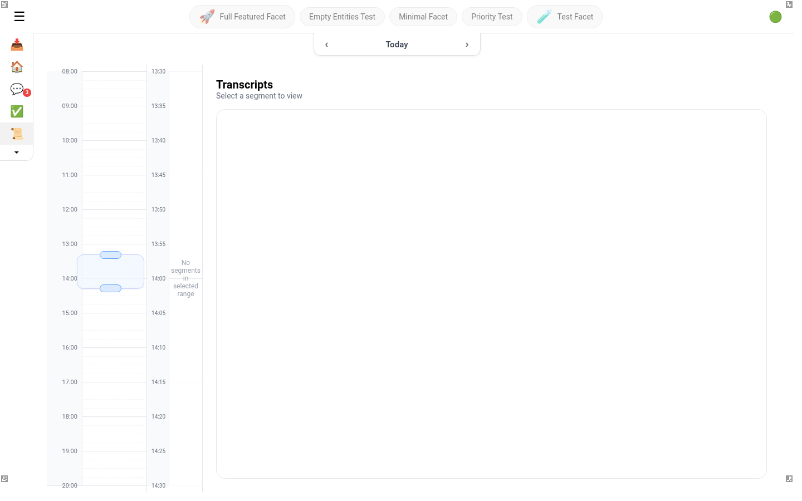
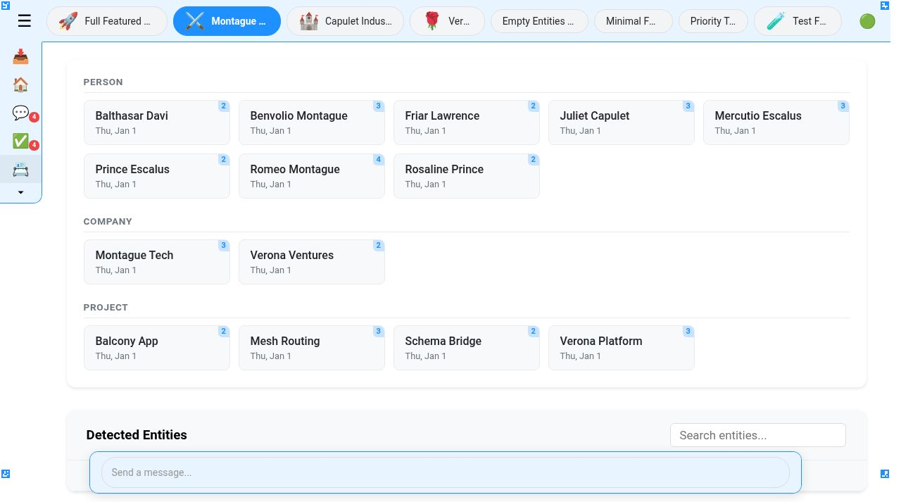

# solstone

your co-brain — captures everything you see and hear, processes it with AI, and gives you superhuman memory.

solstone runs in the background on your computer, recording audio and screen activity. AI agents transcribe, extract entities, detect meetings, build knowledge graphs, and surface daily insights — all without any manual input. everything stays on your machine in daily journal directories. open source, local-first, no cloud required.

Python 3.10+, Linux + macOS, AGPL-3.0-only, maintained by [sol pbc](https://solpbc.org).



*Daily dashboard — goal, todos, upcoming events, and detected entities, all generated from passive capture. Facet tabs organize your life by project or context.*

## what you get

**a system of intelligence, not just a system of record.**

- **automatic transcription** — continuous audio capture (via standalone observers) with speaker identification. every conversation, transcribed and searchable.
- **entity tracking** — people, companies, and projects extracted from your conversations and tracked across time.
- **knowledge graphs** — relationships between entities mapped automatically. who works with whom, which projects connect to which people.
- **meeting detection** — meetings identified, summarized, and linked. meeting prep that surfaces what you discussed last time and personal context you'd forget.
- **commitment tracking** — todos captured from natural conversation. no manual entry.
- **facet organization** — group everything by project or context (work, personal, client-name) with scoped views across all apps.
- **AI chat** — talk to your journal. ask anything about your digital life and get answers grounded in your actual data.
- **full-text search** — find anything you've ever seen or heard.
- **30 AI agents** — configurable workflows for activities, scheduling, research, media analysis, and more. extensible via the agent skill framework.
- **local-first** — all data in daily journal directories on your filesystem. configurable AI providers (Google Gemini, OpenAI, Anthropic). no cloud dependency.



*Transcript viewer — dual-timeline navigation, speaker-diarized dialogue, audio playback, screen capture analysis. every conversation browsable by time.*



*Entity tracking — people, companies, and projects automatically extracted and tracked across your journal with mention counts and relationship data.*

## architecture

```text
  +---------+       +----------------+       +---------+
  | observe | ----> |    journal     | ----> |  think  |
  | capture |       | YYYYMMDD/ dirs |       | process |
  +---------+       | media, jsonl,  |       | index   |
                    | entities       |       +----+----+
                    +-------+--------+            |
                            ^                     |
                            |  agent outputs      |
                       +----+----+                |
                       | cortex  | <--------------+
                       | agents  |
                       +---------+
                            |
  ==== callosum (event bus) | ==========================
                            |
                     +------+------+
                     |   convey    |
                     | web UI      |
                     +-------------+
```

- **observe** — receives captured audio and screen activity from standalone observers (solstone-linux, solstone-tmux, solstone-macos) via remote ingest. processes FLAC audio, WebM screen recordings, and timestamped metadata.
- **think** — transcribes audio (faster-whisper), analyzes screen captures, extracts entities, detects meetings, and indexes everything into SQLite. runs 30 configurable agent/generator templates from `muse/`.
- **cortex** — orchestrates agent execution. receives events, dispatches agents, writes results back to the journal.
- **callosum** — async message bus connecting all services. enables event-driven coordination between observe, think, cortex, and convey.
- **convey** — Flask-based web interface with 17 pluggable apps for navigating journal data.
- **journal** — `journal/YYYYMMDD/` daily directories. the single source of truth — transcripts, media, entities, agent outputs, and the SQLite index all live here.

## quick start

```bash
git clone https://github.com/solpbc/solstone.git
cd solstone
make install

# Configure environment
cp .env.example .env
# Add at minimum: GOOGLE_API_KEY=your-key
# See docs/PROVIDERS.md for all supported providers

# Install as a background service (starts on login, port 5015)
make install-service

# Or start manually for development
sol supervisor
```

See [docs/INSTALL.md](docs/INSTALL.md) for platform-specific dependencies, detailed configuration, and first-run guidance.

## CLI

solstone is operated through the unified `sol` command (33 subcommands).

```bash
sol                    # Status overview and command list
sol supervisor         # Start the full stack (capture + processing + web)
sol chat               # Interactive AI chat from the terminal
sol transcribe <file>  # Transcribe an audio file
sol indexer            # Rebuild the search index
sol screenshot /       # Capture a screenshot of the web UI
```

Run `sol help` for the full command reference.

## documentation

| Topic | Document |
|-------|----------|
| Installation and setup | [docs/INSTALL.md](docs/INSTALL.md) |
| Journal structure and data model | [docs/JOURNAL.md](docs/JOURNAL.md) |
| Capture pipeline | [docs/OBSERVE.md](docs/OBSERVE.md) |
| Processing and agents | [docs/THINK.md](docs/THINK.md) |
| Web interface | [docs/CONVEY.md](docs/CONVEY.md) |
| App development | [docs/APPS.md](docs/APPS.md) |
| Agent runtime | [docs/CORTEX.md](docs/CORTEX.md) |
| Message bus | [docs/CALLOSUM.md](docs/CALLOSUM.md) |
| AI provider configuration | [docs/PROVIDERS.md](docs/PROVIDERS.md) |
| Troubleshooting | [docs/DOCTOR.md](docs/DOCTOR.md) |
| Project direction | [docs/ROADMAP.md](docs/ROADMAP.md) |

## development

See [AGENTS.md](AGENTS.md) for development guidelines, coding standards, and testing instructions.

Use `make dev` to run the full stack against test fixtures, `make ci` for pre-commit checks, and `sol screenshot` for UI testing workflows.

## contributing

See [CONTRIBUTING.md](CONTRIBUTING.md) for contribution terms.

## license

AGPL-3.0-only. See [LICENSE](LICENSE) for details.
Maintained by [sol pbc](https://solpbc.org).
